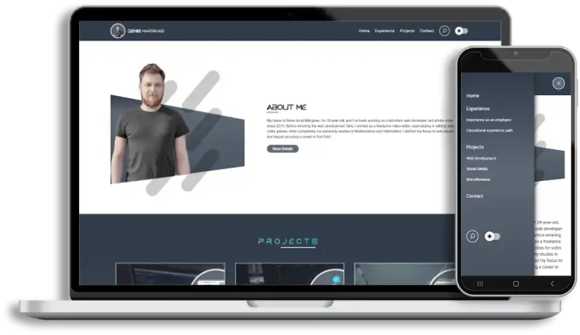

<h2 align="center">
  GitHub Portfolio Website 
  <a href="https://denismarginas.github.io/portfolio/" target="_blank">denismarginas.github.io</a>
</h2>

  

## License
You can fork this repository to modify and make changes of your own. Please give me proper credit by linking back to [denismarginas](https://github.com/denismarginas/portfolio/). Thanks!

## Built With

This project was built using these technologies:

- PHP
- SCSS
- Prepros
- Java Script
- HTML
- CSS3
- VsCode
- PhpStrom
- GitHub
 

## Features

**📖 Multi-Content, such as Pages & Projects are render in bulk**

**🎨 Styled with SCSS and is easy to customize colors and fonts**

**📱 Fully Responsive**

## Getting Started
- Prepros: https://prepros.io/downloads
- Visual Studio Code: https://code.visualstudio.com/download
- PhpStorm: https://www.jetbrains.com/phpstorm/
- XAMPP: https://www.apachefriends.org/download_success.html

## 🛠 Usage Instructions

1. Installation: Install `xampp` or `lampp` which have the PHP version 8.0+.
2. Installation: Install `prepros` and import the theme directory (`dm-theme-01`) in it.
3. Clone Repository: Clone this repository into the `htdocs` directory, creating a new directory named `portfolio`.
4. Rendering HTML and PHP Changes: To render all your HTML pages and apply any PHP changes, run the following URL in your browser: `http://localhost/portfolio/content/render/render.php`.
5. SCSS to CSS Compilation: Any changes made to SCSS files will automatically compile to CSS after saving the changes.
6. Global CSS Changes: To change global CSS settings, such as colors, access `portfolio/themes/dm-theme-01/scss/interface-design/variables.scss`.
7. Adding New Fonts:
    - Add new font(s) manually to `portfolio/themes/dm-theme-01/fonts`.
    - Then, in `portfolio/themes/dm-theme-01/scss/interface-design/fonts.scss`, add the font(s).
    - Finally, use them in the `variables.scss` file by updating the variables `--dm-font-family-primary` and `--dm-font-family-secondary`.
8. Text and Image Content Changes: Change the text and image content of pages in the `portfolio/content/json/data` directory. Several JSON files there influence the rendering content.
9. Editing Rendering Structure: The rendering structure of pages can be edited in the `data-pages.json` file.
10. Editing Project Data and Content: The rendering data and content of projects can be edited in the `data-posts-projects.json` file.

## Usage In GitHub Pages 

1. Create a Repository: Create a repository in your GitHub account named `portfolio`, and add your portfolio project to it.
2. Set Repository to Public: Ensure your repository is set to public.
3. Access GitHub Pages Settings: On the repository page in your GitHub account, access the Settings, then the Pages section (e.g., https://github.com/[your-name]/portfolio/settings/pages).
4. Configure GitHub Pages:
   - In the "Build and deployment" section, under "Source," select `Deploy from a branch`.
   - For "Branch", first select `main` (or your custom named branch), and for the second option, select `/ (root)`. Then save the settings.
5. Publish and Apply Changes: Publishing and applying changes from the repository will take 2-5 minutes on GitHub Pages.
6. [Optional] Create a Redirect Page: You can create a public repository with your name and GitHub Pages domain in this form [your-name].github.io. Add an `index.html` page which will redirect users to your portfolio. For example, this can be done easily with a JavaScript code: .